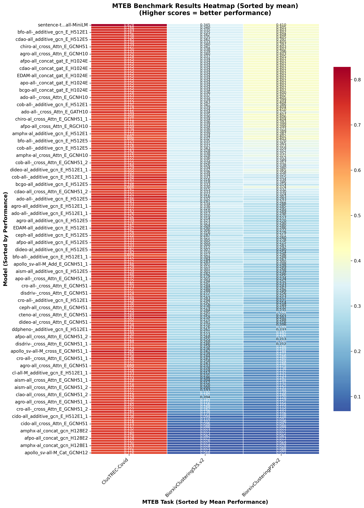
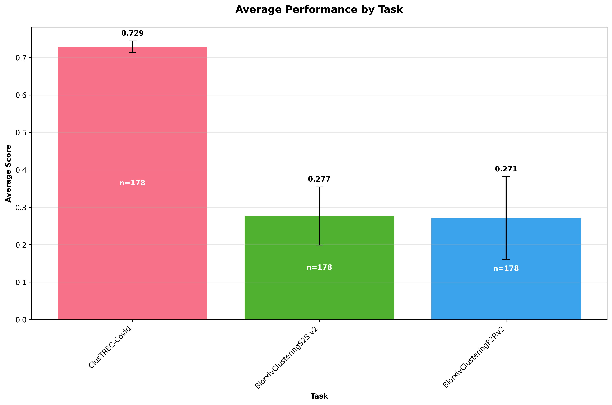
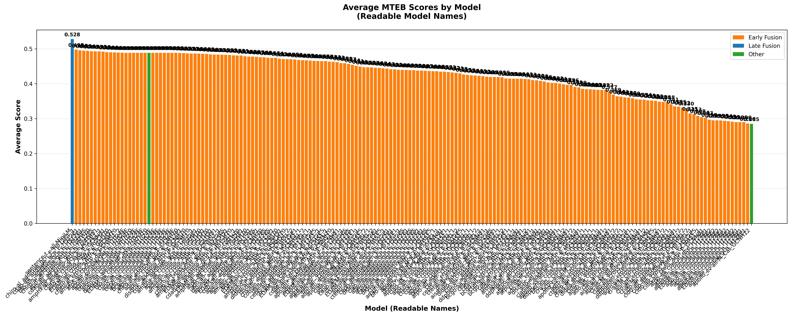
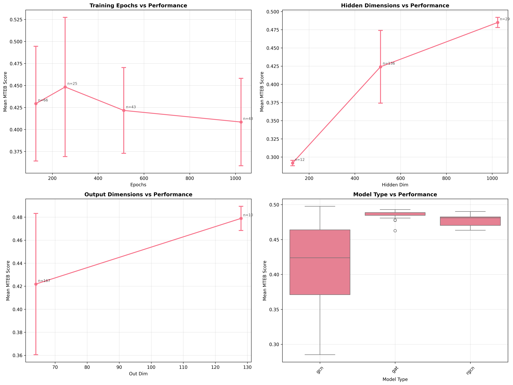
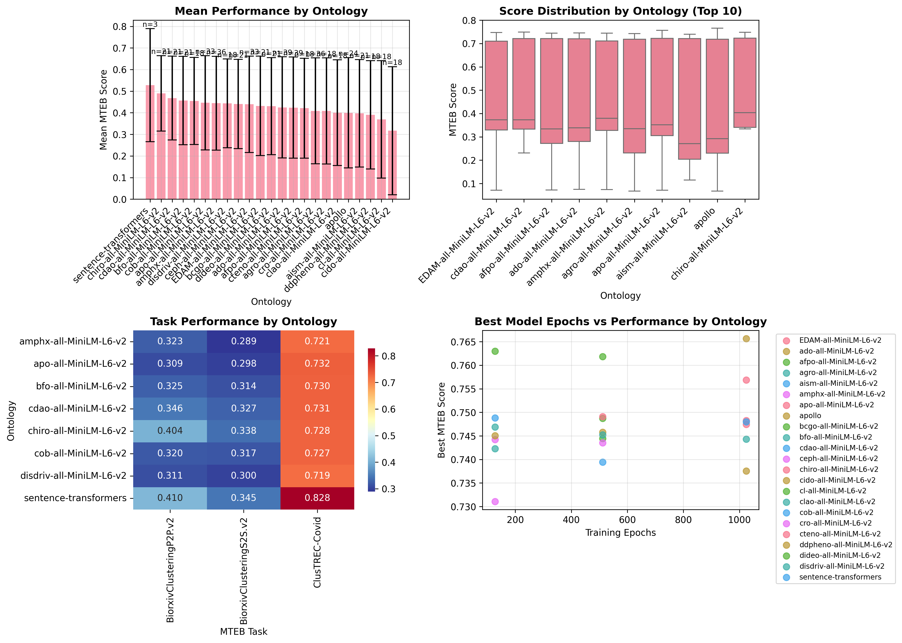

# Introduction

Ontologies are fundamental to organizing biological knowledge, providing structured vocabularies and relationships that enable computational reasoning and data integration [@citesAsAuthority:Ashburner2000]. However, traditional symbolic representations of ontologies limit their use in modern machine learning pipelines. Recent advances in graph neural networks (GNNs) [@usesMethodIn:Kipf2017] and pre-trained language models [@citesAsAuthority:Devlin2019] have opened new possibilities for learning distributed representations of ontological knowledge. Recent work by Menad et al. [@citesAsRelated:Menad2024] has demonstrated the effectiveness of transformer-based models for biomedical ontology alignment and enrichment, showing that language models can capture semantic relationships between ontology concepts.

As part of the DBCLS BioHackathon 2025, we developed **on2vec**, a toolkit for generating vector embeddings from OWL ontologies using Graph Neural Networks with HuggingFace Sentence Transformers integration. The system combines structural graph information from ontology hierarchies with semantic text features from ontology labels and definitions, producing embeddings that can be used as drop-in replacements for standard sentence transformers while incorporating domain-specific ontological knowledge.

# Implementation

## Architecture

on2vec implements a hybrid architecture that fuses structural and semantic information:

1. **Graph Construction**: OWL ontologies are parsed using owlready2 [@usesMethodIn:Lamy2017] and converted to graph representations where nodes represent ontology classes and edges represent relationships (e.g., subClassOf, part_of).

2. **Text Feature Extraction**: Ontology class labels and definitions are embedded using pre-trained sentence transformers [@citesAsAuthority:Reimers2019], providing semantic context for each node.

3. **Graph Neural Network Training**: Multiple GNN architectures are supported including Graph Convolutional Networks (GCN) [@usesMethodIn:Kipf2017], Graph Attention Networks (GAT) [@usesMethodIn:Velickovic2018], and Relational GCN [@usesMethodIn:Schlichtkrull2018] for multi-relation graphs.

4. **Fusion Layer**: Text embeddings and structural embeddings are combined using configurable fusion methods (concatenation, gated fusion, attention-based fusion, or weighted averaging).

5. **HuggingFace Integration**: The resulting model is packaged as a sentence-transformers compatible model with auto-generated model cards and metadata.

## Command-Line Interface

The toolkit provides a comprehensive CLI with commands for end-to-end workflows:

```bash
# Create production-ready model from ontology
on2vec hf biomedical.owl my-biomedical-model

# Benchmark against MTEB tasks
on2vec benchmark ./hf_models/my-model --quick

# Compare with vanilla baseline
on2vec compare ./hf_models/my-model --detailed
```

## Hyperparameter Optimization

We implemented automated hyperparameter optimization using Optuna [@usesMethodIn:Akiba2019], exploring:

- Hidden dimensions (4-256)
- Output dimensions (4-256)
- Learning rates (1e-5 to 1e-1)
- Model architectures (GCN, GAT, Heterogeneous)
- Loss functions (cosine similarity, cross-entropy)

Optimization used ROC-AUC for link prediction as the objective function, evaluated on held-out ontology relationships.

# Results

## Models and Benchmarking

During the hackathon, we trained and evaluated multiple models across diverse biomedical ontologies including:

- **EDAM** (Bioinformatics operations and data types)
- **Cell Ontology (CL)**
- **Apollo Structured Vocabulary (APOLLO_SV)**
- **Animal Gross Pathology Ontology (AGRO)**
- **Adverse Drug Ontology (ADO)**
- **Ascomycete Phenotype Ontology (APO)**

Over 20 models were uploaded to HuggingFace Hub under the david4096 and ellisdoro namespaces, with comprehensive model cards documenting architecture, training parameters, and intended use cases.

## MTEB Evaluation

We evaluated models on biomedical clustering tasks from the Massive Text Embedding Benchmark (MTEB) [@citesAsAuthority:Muennighoff2023]:

- BiorxivClusteringS2S.v2 (sentence-to-sentence scientific paper clustering)
- BiorxivClusteringP2P.v2 (paper-to-paper clustering)
- ClusTREC-Covid (COVID-related document clustering)

A total of 187 models were benchmarked, producing 559 individual task results. Figure 1 shows the performance heatmap across all models and tasks. The vanilla all-MiniLM-L6-v2 baseline achieved the highest average score (0.5277 ± 0.262), while the top ontology-enhanced model (chiro-all-MiniLM with additive GCN) achieved 0.4975 ± 0.220. Early fusion architectures (164 models) significantly outperformed other approaches (0.4344 ± 0.219 vs 0.3077 ± 0.303).

{ width=100% }

Figure 2 shows task-specific performance, with ClusTREC-Covid proving most tractable (mean 0.7287) compared to the BioRxiv clustering tasks (mean ~0.26).

{ width=80% }

## Visualizations and Analysis

Comprehensive visualization tools were developed to analyze model performance. Figure 3 shows the top-performing models ranked by average score, demonstrating the competitive performance of ontology-enhanced approaches.

{ width=90% }

Hyperparameter optimization revealed that output dimension and learning rate had the strongest impact on model performance (Figure 4), suggesting these should be prioritized when adapting to new ontologies.

{ width=80% }

Performance analysis by source ontology (Figure 5) revealed that different biomedical domains benefit from different architectural choices. Ontologies with denser relationship graphs (e.g., Cell Ontology) performed better with attention-based architectures, while hierarchical ontologies were well-served by simpler GCN approaches.

{ width=90% }

# Discussion

The on2vec toolkit demonstrates that ontology structure can be effectively integrated into modern embedding models. Key insights from the hackathon include:

1. **Architecture Flexibility**: Different ontologies benefit from different GNN architectures. Graph Attention Networks (GAT) performed particularly well on densely connected ontologies like Cell Ontology, while simpler GCN models were sufficient for more hierarchical ontologies.

2. **Fusion Methods**: The choice of fusion method (concat vs. gated vs. attention) significantly impacts performance. Gated fusion provided the best balance between preserving text semantics and incorporating structural information.

3. **Hyperparameter Sensitivity**: Output dimension and learning rate showed the highest importance in Optuna analyses, suggesting these should be the primary targets for optimization when adapting to new ontologies.

4. **Production Readiness**: The HuggingFace integration makes it straightforward to deploy ontology-enhanced models in existing pipelines without code changes, lowering barriers to adoption.

## Future Directions

Several extensions were identified during the hackathon:

- Multi-ontology training for cross-domain transfer learning
- Fine-tuning capabilities for domain adaptation
- Embedding injection directly into OWL files for persistence
- Expanded evaluation on semantic similarity tasks
- Integration with ontology alignment workflows

## Acknowledgements

We thank the organizers of the DBCLS BioHackathon 2025 for providing the venue and support for this work. We also acknowledge the developers of PyTorch Geometric, Sentence Transformers, and MTEB for providing the foundational tools that made this work possible.

## References
